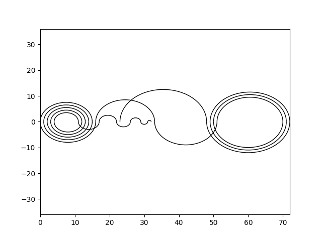

# Recamán

A basic python module for generating Recamán sequence variations and
some interesting graphs of those sequences.

## Usage

`recaman.seq(length, origin)`

To generate a sequence of the given length, starting the sequence calculation at the origin. Returns the resulting sequence in a tuple together with the highest number contained in the sequence, which can then be fed into `val_plot` or `circles` to produce some nice visualizations.

For instance, `circles(seq(64, 0))` yields:

A change of origin with `seq(64, 32)` produces a graph with some interesting differences:

As does origin 64:

