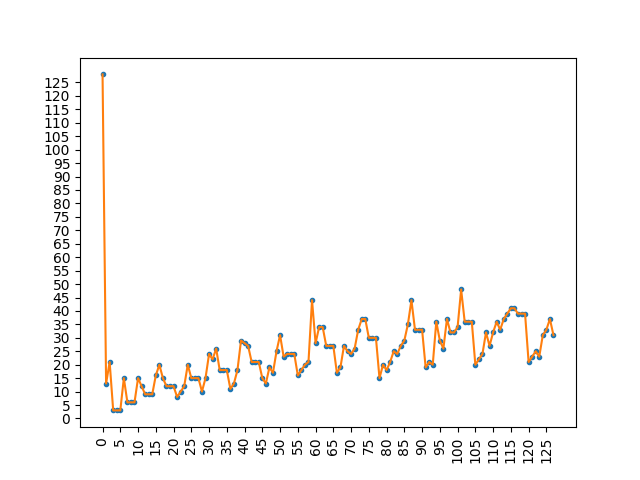

# Recamán

A basic python module for generating Recamán sequence variations and
some interesting graphs of those sequences.

## Usage

`recaman.seq(length, origin, op)`

where `op` is `1` for the first sequence variation (“subtract if possible, otherwise add”) or `2` for the second (“divide if possible, otherwise multiply”).

To generate a sequence of the given length, starting the sequence calculation at the origin. Returns the resulting sequence in a tuple together with the highest number contained in the sequence, which can then be fed into `val_plot` or `circles` to produce some nice visualizations.

For instance, `circles(*seq(64, 0, 1))` yields the first 64 members of the basic sequence:

A change of origin with `seq(64, 32, 1)` produces a graph with some interesting differences and definite endpoint. Due to the way the sequence works, starting at an origin other than zero introduces the possibility of a finite sequence:

As you can see again with origin 64:

Interesting patterns emerge almost immediately! For instance, look at this plot of origin points to resulting sequence lengths for an (attempted) 128 member sequence:

Starting at x = 3, an interesting pattern emerges - triplets of the multiples of three, separated by a constantly incrementing number of values!

For more information on the Recamán sequence, see the entry in the [Online Encyclopedia of Integer Sequences](https://oeis.org/wiki/Recam%C3%A1n%27s_sequence).

The change of origin mechanism could also be implemented differently, to begin with a jump size equal to the origin (rather than starting at zero regardless of origin choice). This can produce some equally interesting patterns and can be easily implemented with a slight change to the `seq` method.
